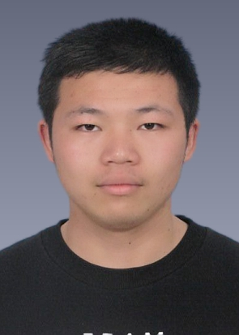

## BIOGRAPHY

Hi! I am a Ph.D. candidate in Wuhan National Laboratory for Optoelectronics (WNLO) of Huazhong University of Science and Technology (HUST).

## Research Interest

1. Computer System Architecture
2. Cache, Storage
3. Machine Learning, Reinforcement Learning

## PUBLICATIONS

1. [**CMC**] Chunhua Li, **Peng Wang**, Changhong Sun, Ke Zhou, Ping Huang. 2019. WiBPA: An Efficient Data Integrity Auditing Scheme Without Bilinear Pairings. Computers, Materials & Continua, 2019, 58(2): 319-333.
2. [**IJCAI**] Yanzhao Xie, Yu Liu, Yangtao Wang, Lianli Gao, **Peng Wang**, Ke Zhou. Label-Attended Hashing for Multi-Label Image Retrieval. International Joint Conference on Artificial Intelligence 2020:955-962.

## EDUCATION

* Sep 2018 - Now Ph.D. in Wuhan National Laboratory for Optoelectronics (WNLO).
* Sep 2014 - Jun 2018 Bachelor's degree, College of science, huazhong agricultural university (HZAU).

## CONTACT

* Mailing Address: Luoyu Road 1037, Wuhan, China
* Email: [wp_hust@hust.edu.cn](mailto:wp_hust@hust.edu.cn)
